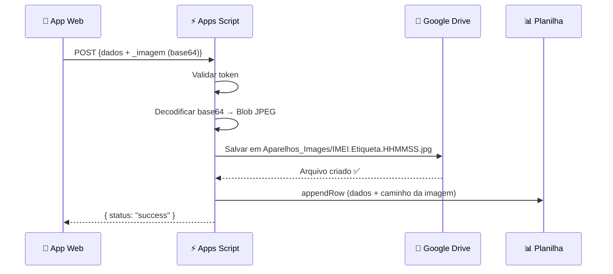

# Novo Código Apps Script — doPost com Salvamento de Imagem

> **Este código resolve DEFINITIVAMENTE o erro `Você não tem permissão para chamar DriveApp.getFileById`.**

## 🚨 POR QUE O ERRO ACONTECE E COMO RESOLVER EM 1 MINUTO

O Google Apps Script bloqueia a função `DriveApp.getFileById` em chamadas externas se a autorização exata desse método não for realizada no editor ou se a implantação estiver rodando uma versão antiga em cache.

Temos **2 formas** de resolver isso. Escolha a **MÉTODO 1** (mais rápido) ou o **MÉTODO 2** (definitivo a prova de falhas):

---

### MÉTODO 1: Rodar a Nova Função de Autorização e Gerar Nova Versão

1. No Google Sheets, vá em **Extensões → Apps Script**.
2. Substitua todo o código lá dentro pelo **Código Completo** abaixo e clique em **Salvar** (💾).
3. No menu suspenso ao lado do botão **▶ Executar**, selecione a função **`autorizarPermissoes`**.
4. Clique em **▶ Executar**.
5. Na janela que abrir:
   * Clique em **Revisar permissões** → Escolha sua conta.
   * Clique em **Avançado** (texto cinza) → **Acessar Projeto sem título (não seguro)** → **Permitir**.
6. ⚠️ **O PASSO MAIS IMPORTANTE:**
   * Vá em **Implantar → Gerenciar implantações**.
   * Clique no ícone de **lápis (✏️ editar)** na implantação ativa.
   * No campo **Versão**, clique na setinha e mude de *(versão 1...)* para **Nova versão**! *(Se você não mudar para "Nova versão", o Google continuará rodando o código velho sem permissão)*.
   * Clique em **Implantar**.

---

### MÉTODO 2 (Se o Método 1 não resolver): Forçar as Permissões no Manifesto

Se você já gerou "Nova versão" e o erro insistir, vamos dizer diretamente ao Google para liberar o Drive:

1. No painel esquerdo do Apps Script, clique em **⚙️ Configurações do projeto**.
2. Marque a caixinha: **"Mostrar arquivo de manifesto 'appsscript.json' no editor"**.
3. Clique em **⟨⟩ Editor** no menu esquerdo. Agora você verá o arquivo `appsscript.json` na lista.
4. Clique em `appsscript.json` e substitua tudo por isto:
```json
{
  "timeZone": "America/Sao_Paulo",
  "dependencies": {},
  "exceptionLogging": "STACKDRIVER",
  "runtimeVersion": "V8",
  "oauthScopes": [
    "https://www.googleapis.com/auth/spreadsheets",
    "https://www.googleapis.com/auth/drive"
  ]
}
```
5. Clique em **Salvar** (💾).
6. Rode a função `autorizarPermissoes` novamente e gere uma **Nova versão** em **Gerenciar implantações**.

---

## Código Completo para Colar no arquivo Código.gs

```javascript
/**
 * ⚠️ RODE ESTA FUNÇÃO UMA VEZ NO EDITOR PARA FORÇAR A LIBERAÇÃO DO DRIVE!
 */
function autorizarPermissoes() {
  var planilhaId = SpreadsheetApp.getActiveSpreadsheet().getId();
  var arquivo = DriveApp.getFileById(planilhaId);
  var pastaPai = arquivo.getParents().next();
  Logger.log("✅ Permissão TOTAL ao Drive liberada com sucesso! Pasta da planilha: " + pastaPai.getName());
}

function doPost(e) {
  try {
    // Pega a aba ativa da planilha atual
    var sheet = SpreadsheetApp.getActiveSpreadsheet().getActiveSheet();
    
    // Converte os dados recebidos do aplicativo (que vêm em JSON)
    var data = JSON.parse(e.postData.contents);
    
    // Validação de Token de segurança
    var token_esperado = "inventario2026"; 
    
    if (token_esperado !== "" && data._token !== token_esperado) {
       throw new Error("Acesso negado: Token inválido");
    }

    // Remove o token antes de salvar
    delete data._token;

    // ═══════════════════════════════════════════
    // SALVAR IMAGEM NO GOOGLE DRIVE
    // ═══════════════════════════════════════════
    var etiquetaPath = "";
    
    if (data._imagem) {
      var imageBase64 = data._imagem;
      delete data._imagem;  // Remove do payload antes de salvar na planilha
      
      try {
        // Encontrar a pasta pai da planilha no Drive
        var spreadsheetFile = DriveApp.getFileById(
          SpreadsheetApp.getActiveSpreadsheet().getId()
        );
        var parentFolder = spreadsheetFile.getParents().next();
        
        // Criar ou encontrar a pasta "Aparelhos_Images"
        var folder;
        var folders = parentFolder.getFoldersByName("Aparelhos_Images");
        if (folders.hasNext()) {
          folder = folders.next();
        } else {
          folder = parentFolder.createFolder("Aparelhos_Images");
        }
        
        // Gerar nome do arquivo: IMEI.Etiqueta.HHMMSS.jpg
        var now = new Date();
        var timestamp = Utilities.formatDate(now, Session.getScriptTimeZone(), "HHmmss");
        var imeiPart = data.imei || "sem_imei";
        // Limpar caracteres inválidos do IMEI (pode ter barras se tiver 2 IMEIs)
        imeiPart = imeiPart.replace(/[\/\\|]/g, "_");
        var fileName = imeiPart + ".Etiqueta." + timestamp + ".jpg";
        
        // Decodificar base64 e criar o arquivo
        var blob = Utilities.newBlob(
          Utilities.base64Decode(imageBase64),
          "image/jpeg",
          fileName
        );
        var file = folder.createFile(blob);
        
        // Caminho relativo (mesmo padrão dos dados existentes)
        etiquetaPath = "Aparelhos_Images/" + fileName;
        
      } catch (imgError) {
        // Se falhar ao salvar imagem, continua salvando os dados
        etiquetaPath = "ERRO: " + imgError.toString();
      }
    }

    // ═══════════════════════════════════════════
    // SALVAR DADOS NA PLANILHA
    // ═══════════════════════════════════════════
    // Coluna A (Código) = vazio — é preenchida por fórmula da planilha
    // Colunas B-I = dados do app
    // Coluna J (flag) = FALSE (padrão)
    // Coluna K (Etiqueta) = caminho da imagem salva no Drive
    sheet.appendRow([
      "",                        // A: Código (fórmula da planilha)
      new Date(),                // B: Data/Hora do registro
      data.tipo || "",           // C: Tipo
      data.marca || "",          // D: Marca
      data.modelo || "",         // E: Modelo
      data.imei || "",           // F: IMEI
      data.sn || "",             // G: Nº Série
      data.acessorios || "",     // H: Acessórios
      data.material || "",       // I: Material
      false,                     // J: Flag (padrão FALSE)
      etiquetaPath               // K: Etiqueta (caminho da imagem no Drive)
    ]);

    // Retorna mensagem de sucesso
    return ContentService.createTextOutput(JSON.stringify({ 
      "status": "success",
      "etiqueta": etiquetaPath
    })).setMimeType(ContentService.MimeType.JSON);

  } catch (error) {
    // Em caso de erro, retorna a mensagem do erro
    return ContentService.createTextOutput(JSON.stringify({ 
      "status": "error", 
      "message": error.toString() 
    })).setMimeType(ContentService.MimeType.JSON);
  }
}
```

---

## Como Funciona o Salvamento de Imagem



---

## Estrutura da Planilha (11 colunas)

| Coluna | Campo | Fonte |
|:--|:--|:--|
| A | Código | Fórmula da planilha |
| B | Data/Hora | `new Date()` |
| C | Tipo | IA + edição |
| D | Marca | IA + edição |
| E | Modelo | IA + edição |
| F | IMEI | IA + edição |
| G | Nº Série | IA + edição |
| H | Acessórios | IA + edição |
| I | Material | IA + edição |
| J | Flag | `false` (padrão) |
| **K** | **Etiqueta** | **Caminho da imagem salva no Drive** |

---

## Padrão de Nomes das Imagens

O arquivo é salvo seguindo o mesmo padrão dos dados existentes:

```
Aparelhos_Images/358459768232759.Etiqueta.143510.jpg
                 └─── IMEI ────┘          └ HH:MM:SS
```

- Se houver 2 IMEIs (separados por `/`), as barras são substituídas por `_`
- Se não houver IMEI, usa `sem_imei`

---

## ⚠️ Notas Importantes

1. **Imagem reduzida**: O app envia uma versão redimensionada (~1200px de largura, JPEG 80%) para economia de dados. A imagem original em alta resolução é usada apenas para a IA.

2. **Pasta no Drive**: As imagens são salvas na pasta `Aparelhos_Images` que fica no **mesmo diretório** da planilha no Google Drive. Se a pasta não existir, ela é criada automaticamente.

3. **Permissões**: Na primeira execução, o Apps Script pedirá permissão para acessar o Drive. Aceite.

4. **Tolerância a falhas**: Se a imagem falhar ao salvar (ex: muito grande), os dados textuais ainda são salvos na planilha normalmente. A coluna Etiqueta mostrará `ERRO: [mensagem]`.


